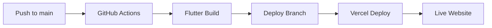

# 🚀 Deployment Guide

This guide explains how to deploy your Flutter Portfolio to Vercel using GitHub Actions.

## 🔄 Automated Deployment Workflow

### How It Works
1. **Push to main branch** triggers the GitHub Action
2. **Flutter web build** is created automatically
3. **Build output** is pushed to `deploy` branch
4. **Vercel** deploys from the `deploy` branch

### Workflow Steps


## 🛠️ Setup Instructions

### 1. GitHub Actions (Already Configured)
The workflow file `.github/workflows/deploy.yml` is already set up and will:
- ✅ Build Flutter web app
- ✅ Run tests and analysis
- ✅ Push to `deploy` branch
- ✅ Create build summaries

### 2. Vercel Setup

#### Option A: Connect via Vercel Dashboard
1. **Go to [Vercel Dashboard](https://vercel.com/dashboard)**
2. **Click "New Project"**
3. **Import your GitHub repository**: `ryanmviajedor/flutter_portfolio`
4. **Configure Project**:
   - **Framework Preset**: Other
   - **Root Directory**: `./` (leave default)
   - **Build Command**: Leave empty (we use GitHub Actions)
   - **Output Directory**: Leave empty
   - **Install Command**: Leave empty

5. **Advanced Settings**:
   - **Source**: Change to `deploy` branch (important!)
   - **Auto-deploy**: Enable for `deploy` branch only

#### Option B: Vercel CLI
```bash
# Install Vercel CLI
npm i -g vercel

# Login to Vercel
vercel login

# Link project (run in project root)
vercel link

# Deploy from deploy branch
vercel --prod
```

### 3. Environment Variables (Optional)
If you need environment variables in Vercel:
1. Go to Project Settings → Environment Variables
2. Add any required variables
3. Redeploy if needed

## 🔧 Configuration Files

### `.github/workflows/deploy.yml`
- **Triggers**: Push to main branch
- **Actions**: Build, test, deploy to `deploy` branch
- **Flutter Version**: 3.24.3 (stable)
- **Web Renderer**: HTML (for better compatibility)

### `vercel.json`
- **Static file serving** configuration
- **SPA routing** (all routes → index.html)
- **Security headers** for production
- **Cache optimization** for assets

## 📊 Monitoring Deployments

### GitHub Actions
- **View workflows**: Repository → Actions tab
- **Build logs**: Click on any workflow run
- **Status badges**: Available in Actions tab

### Vercel Dashboard
- **Deployment history**: Project → Deployments
- **Build logs**: Click on any deployment
- **Performance metrics**: Available in dashboard

## 🐛 Troubleshooting

### Common Issues

#### 1. Build Fails
```bash
# Check Flutter version compatibility
flutter --version

# Update dependencies
flutter pub get
flutter pub upgrade
```

#### 2. Deploy Branch Not Created
- Check GitHub Actions permissions
- Ensure `GITHUB_TOKEN` has write access
- Verify workflow file syntax

#### 3. Vercel Not Deploying
- Confirm Vercel is watching `deploy` branch
- Check Vercel build logs
- Verify `vercel.json` configuration

#### 4. Assets Not Loading
- Check file paths in Flutter build
- Verify base href in `web/index.html`
- Review Vercel routing configuration

### Debug Commands
```bash
# Local build test
flutter build web --release

# Check build output
ls -la build/web/

# Test locally
cd build/web && python -m http.server 8000
```

## 🚀 Deployment Process

### Automatic Deployment
1. **Make changes** to your Flutter code
2. **Commit and push** to main branch:
   ```bash
   git add .
   git commit -m "feat: Add new feature"
   git push origin main
   ```
3. **GitHub Actions** automatically builds and deploys
4. **Vercel** detects changes in `deploy` branch and deploys

### Manual Deployment
```bash
# Build locally
flutter build web --release

# Push to deploy branch manually (if needed)
git checkout deploy
cp -r build/web/* .
git add .
git commit -m "Manual deploy"
git push origin deploy
```

## 📈 Performance Optimization

### Build Optimizations
- **Web renderer**: HTML (better compatibility)
- **Release mode**: Optimized for production
- **Asset caching**: Configured in `vercel.json`
- **Compression**: Automatic via Vercel

### Monitoring
- **Vercel Analytics**: Available in dashboard
- **Core Web Vitals**: Tracked automatically
- **Performance insights**: Real user metrics

## 🔗 Useful Links

- **Vercel Documentation**: https://vercel.com/docs
- **Flutter Web**: https://docs.flutter.dev/platform-integration/web
- **GitHub Actions**: https://docs.github.com/en/actions

---

🎉 **Your Flutter Portfolio is now set up for automatic deployment!**

Every push to the main branch will trigger a new deployment to Vercel.
